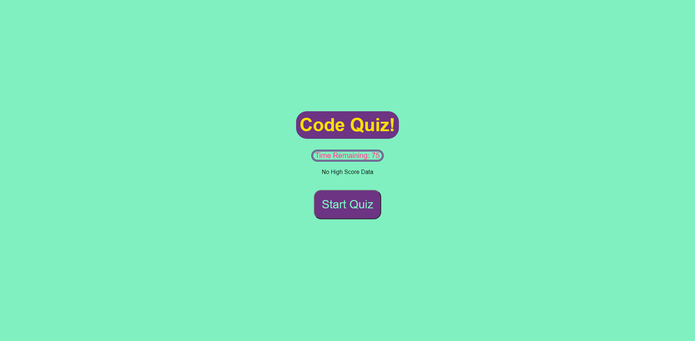

# Code Quiz
## Summary

The Purpose of this application is to provide a short coding quiz made up of 5 question with 4 choices and one answer. At the end of the quiz you are given the time you have remaining and the option to enter your initials and save your high score which upon refresh will be displayed towards the top of the page.

## Technologies
* HTML - 7.5%
* CSS - 29.1%
* JavaScript - 63.4%

## Code Breakdown
the page loads with a <h1> tag and two div tags one that shows you how much time you will be given and one that shows you you're High Score if its your first time taking the quiz the div will show "No High Score Data" (the content like most HTML elements and text are made through JS). below that will be a "Start Quiz" button that triggers which triggers a function through an event listener which listen for a click. The function starts the timer (if the player runs out of time the "endQuiz()" function is triggered) and at the same time starts the "quiz()" function that adds all of the questions and answers through a "for" loop. after each run of the "quiz()" function a nestled function will trigger the "validate()" function that checks your answer to see if your correct or incorrect. It does this through the use of if and else statements inside an if statement, after you answer it will tell you if you got it right or wrong by appending a child called "result". Through the iterator the "setInterval" function can compare it to the "question.length" to see if all questions have been answered once they have the "endQuiz()" function is triggered. This function is in charge of creating the ending screen and collecting data. it does this by creating several HTML elements and using your initials submission and time remaining score and saves it to your local storage. If your score is higher than the current high score the new score will replace it, if not it'll give you a message to try again.

## Active Page
https://khyan22.github.io/code-quiz/

## Page ScreenShot
